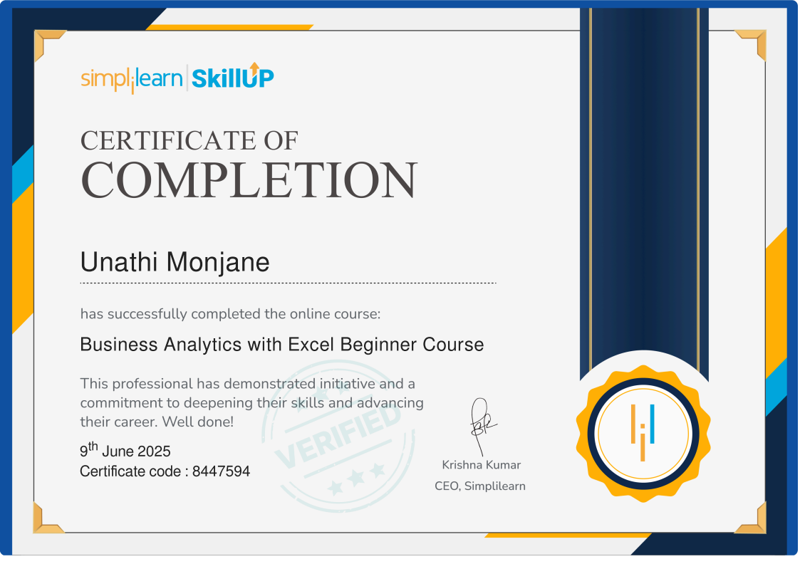

# Unathi Monjane Portfolio

Welcome to my personal portfolio! This website showcases my skills, projects, certifications, and services as a **Full Stack Developer** and **AI & IT Process Support Associate**.

---

## 💡 About CodeCraft Africa

I’m also the co-founder of **[CodeCraft Africa](https://unathi-monjane.github.io/codecraft-africa-portfolio)**, a company dedicated to building modern websites and digital solutions for businesses across Africa. Our goal is to help businesses, schools, and organizations create responsive, user-friendly, and scalable digital platforms that drive results.

---

## 🌟 Features

- **Hero Section:** Introduction with profile image and call-to-action button.  
- **About Me:** Professional summary and interests.  
- **Services:** Web development, responsive design, e-commerce, website maintenance, and AI/IT support.  
- **Projects:** Featured projects with live links and screenshots.  
- **Certificates:** All professional certifications displayed with Netflix-inspired hover effects.  
- **Skills & Tech Stack:** Animated progress bars showing proficiency in key technologies.  
- **Responsive Design:** Mobile-first layout compatible with all devices.  
- **Smooth Animations:** Scroll animations, hover effects, and back-to-top button.  
- **Modern Dark Theme:** Netflix-inspired dark palette with red accent highlights.

---

## 🖥️ Live Demo

[View Portfolio Live](https://Unathi-Monjane.github.io/unathi-monjane-portfolio)  

---

## ⚡ Skills & Tech Stack

| Technology | Proficiency |
|------------|-------------|
| HTML5      |  |
| CSS3       |  |
| JavaScript |  |
| Python     |  |
| Git/GitHub |  |
| AI Tools   |  |

> The red color is inspired by Netflix's signature accent.

---

## 🏆 Certifications

Here are the certifications I’ve earned:

| Certificate | Preview |
|-------------|---------|
| Business Analytics with Excel |  |
| Career Essentials in System Administration |  |
| Full Stack Development |  |
| Introduction to Computer Networking |  |
| ITIL Introduction V4 |  |
| Microsoft AI Fluency |  |
| Microsoft Office 365 |  |

---

## 💻 Projects

| Project | Demo |
|---------|------|
| BlueVault — Movie App | [Live Demo](https://unathi-monjane.github.io/bluevault) |
| Clothify — E-commerce Store | [Live Demo](https://unathi-monjane.github.io/clothify) |
| EduTime — Productivity Timer | [Live Demo](https://unathi-monjane.github.io/edutime) |
| TaskNet — Notepad App | [Live Demo](https://unathi-monjane.github.io/tasknet) |
| Weatherly — Weather App | [Live Demo](https://unathi-monjane.github.io/weatherly) |

---

## 📫 Contact

- **Email:** unathimonjane14@gmail.com  
- **LinkedIn:** [Connect with me](https://www.linkedin.com/in/unathi-monjane-832a38240)  

---

## 🚀 How to Run Locally

1. Clone this repository:  
   ```bash
   git clone https://github.com/Unathi-Monjane/unathi-monjane-portfolio.git
Navigate into the folder:

bash
Copy
Edit
cd unathi-monjane-portfolio
Open index.html in your browser.

🖤 License
This project is open source and available under the MIT License.

Thank you for visiting my portfolio!
I’m actively seeking entry-level roles, internships, or learnerships in Software Development, AI, or Cybersecurity.
Let’s build the future together! 🚀


